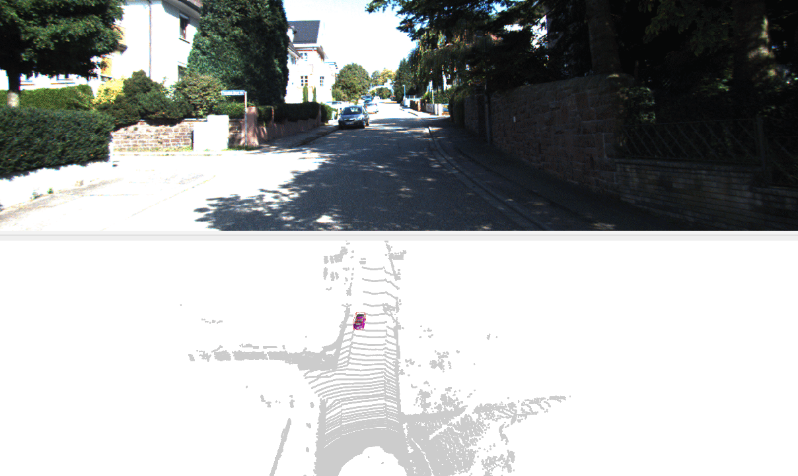

# AmPCL

提供点云处理的`Python`实现，**仓库在迭代更新中，部分API的命名或有出入**

## 安装

### 安装依赖

- ROS1 / ROS2（如需要用到ROS的相关插件）
- 包构建工具和拓展库构建工具

```bash
$ pip3 install -U --user build pip setuptools wheel
$ sudo apt install pybind11-dev
```

### 构建安装和安装包


```bash
$ git clone https://github.com/Natsu-Akatsuki/PointCloud-PyUsage --depth=1
$ cd PointCloud-PyUsage
$ bash install.sh
```

> **Note**
>
> 使用开发模式可能出现`its build backend is missing the 'build_editable' hook`的报错，则可能是系统级别的`setuptools`的版本覆盖了高版本的`setuptools`。通过如下命令行可查询当前的版本`python3 -c "import setuptools; print(setuptools.__version__)" `

## 程序

|      包名       |                    作用                    |
| :-------------: | :----------------------------------------: |
|      `io`       |             导入和导出点云文件             |
| `visualization` |                 点云可视化                 |
|      `ros`      | 动态调参，ROS消息类型和numpy类型的相互转换 |
|    `filter`     |            点云下采样和直通滤波            |

### IO

- 支持`npy`，`pcd`，`bin`点云文件的读取
- 目前支持读取的字段只包括`xyz`，`xyzi`（且需要是float32类型的数据），其他数据需参考代码自行调整

```python
# >>> import usage >>>
from ampcl.io import load_pointcloud

# low-level API
pointcloud = load_npy("ampcl/data/pointcloud.npy")
pointcloud = load_txt("ampcl/data/pointcloud.txt")
pointcloud = load_pcd("ampcl/data/pointcloud_ascii.pcd")
# high-level API（支持npy, pcd, bin文件）
pointcloud = load_pointcloud(".ampcl/data/pointcloud.pcd")

# >>> export usage >>>
save_pointcloud(pointcloud, "pointcloud.pcd")

from pointcloud_utils.io import c_load_pcd
c_load_pcd(".ampcl/data/pointcloud_ascii.pcd")
```

### ROS

- 支持ROS1和ROS2

```python
from ampcl.ros.marker import create_bounding_box_marker
```

### Visualization

- 可视化激光点云
- 基于强度实现点云伪彩色增强

```python
from ampcl.io import load_pointcloud
from ampcl.visualization import o3d_viewer_from_pointcloud
pointcloud = load_pointcloud("ampcl/data/pointcloud_ascii.pcd")
o3d_viewer_from_pointcloud(pointcloud)
```

- 基于ROS可视化KITTI数据集（三维目标检测），真值采用经OpenPCDet处理后的文件

```bash
$ cd dataset_visualization/3D_object_detection

# 步骤一：修改config/kitti.yaml中的数据集路径和相关参数

# 步骤二：启动程序
(ROS1) $ python3 visualize_pcdet_result_ros1.py
(ROS1) $ rviz -d kitti_ros1.rviz

(ROS2) $ python3 visualize_pcdet_result_ros2.py
(ROS2) $ rviz2 -d kitti_ros2.rviz
```


<p align="center">

</p>

## 命令行

### 可视化点云

- 基于`Open3D`的点云可视化，支持`npy`，`pcd`，`bin`点云文件的可视化，目前支持的字段包括`xyz`，`xyzi`
- 强度字段使用伪彩色增强

```bash
$ o3d_viewer <pointcloud_file>
# 如遇到KITTI数据集这种将强度进行过归一化的则需要加上-n选项
$ o3d_viewer -n <pointcloud_file>
```

<p align="center">

</p>

### 点云类型转换

> **Note**
> 现仅支持读取字段为xyzi，格式为npy, pcd, bin的点云

```bash
# 默认转换为pcd
$ convert_pointcloud <点云文件名>
# 指定导出为npy格式
$ convert_pointcloud -t npy <点云文件名>
```

## BUG

- [ ] 不论是否处于虚拟环境，用开发模式安装的包都无法被`Pycharm`智能识别，`Cannot find reference`
- [ ] `build`构建虚拟环境后，执行的`pip`为非用户路径下的`pip`，如若系统路径未安装`pip`，则会显示`No module named pip`

## 规范

- 遵从`pep660`（`setuptools`至少需要`v64.0`才支持单个toml下的`develop`模式）（@[ref](https://stackoverflow.com/questions/69711606/how-to-install-a-package-using-pip-in-editable-mode-with-pyproject-toml)）

## 参考资料

|                             仓库                             |                 参考                 |
| :----------------------------------------------------------: | :----------------------------------: |
|    [ros_numpy](https://github.com/eric-wieser/ros_numpy)     | `ROS1` 点云数据和`numpy`数据相互转换 |
|   [ros2_numpy](https://github.com/Box-Robotics/ros2_numpy)   | `ROS1` 点云数据和`numpy`数据相互转换 |
| [ddynamic_reconfigure_python](https://github.com/pal-robotics/ddynamic_reconfigure_python) |           `ROS1` 动态调参            |
|     [OpenPCDet](https://github.com/open-mmlab/OpenPCDet)     |          神经网络算子和标定          |
|       [pykitti](https://github.com/utiasSTARS/pykitti)       |          `KITTI`数据集读取           |
| [livox_mapping](https://github.com/Livox-SDK/livox_mapping)  |          基于强度值的伪彩色          |
| [3D-Detection-Tracking-Viewer](https://github.com/hailanyi/3D-Detection-Tracking-Viewer) |        检测结果采用车体3D模型        |
| [EagerMOT](https://github.com/aleksandrkim61/EagerMOT/blob/open_main/inputs/bbox.py#L121) |       检测框内的点赋予颜色信息       |
| [livox_horizon_loam](https://github.com/Livox-SDK/livox_horizon_loam/blob/master/src/livox_repub.cpp) |       Livox自定义消息类型转换        |
|      [AB3DMOT](https://github.com/xinshuoweng/AB3DMOT)       |   基于卡尔曼滤波的三维目标跟踪模块   |
