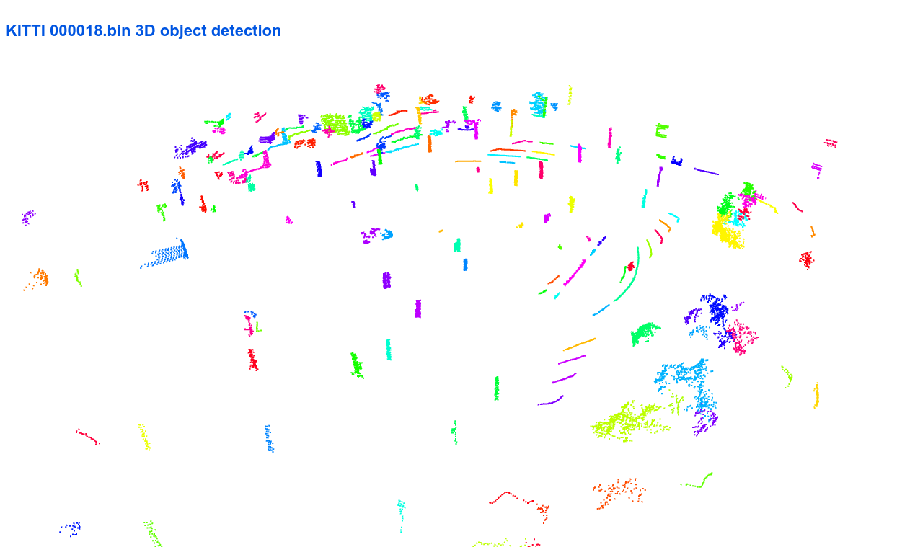

# Usage

## Ground segmentation

### Implementation

#### RANSAC

- **论文**：Random sample consensus: a paradigm for model fitting with applications to image analysis and automated cartography
- **示例代码**：

```python
from ampcl.perception import ground_segmentation_ransac
from ampcl.io import load_pointcloud

pc_np = load_pointcloud("...")
# 设置地平面样本点的大概位置 (x_min, x_max, y_min, y_max, z_min, z_max)
limit_range = (0, 50, -10, 10, -2.5, -0.5)
plane_model, ground_mask = ground_segmentation_ransac(pc_np, limit_range, distance_threshold=0.2, debug=True)
ground_pc = pc_np[ground_mask]
non_ground_pc = pc_np[~ground_mask]
```

<p align="center">

</p>

#### GPF

- **论文**：Fast Segmentation of 3D Point Clouds: A Paradigm on LiDAR Data for Autonomous Vehicle Applications
- **亮点**：coarse to fine（更准确的地面点和更准确的平面模型）, PCA计算地平面模型
- **算法流程**：

1. 去除因镜面反射而产生的噪点（移除太低的点：-1.5×传感器相对地面的高度）
2. 选取地面种子点（前n个z值最低的点的均值+高度offset作为种子点的z轴阈值，保留低于该阈值的点），基于PCA生成地平面模型
3. 基于地平面模型，获取新的地面点，并基于该新的地面点更新地平面模型，重复该步骤多次

- **示例代码**：

```python
# pybind版本（recommend）
from ampcl.perception import ground_segmentation_gpf
from ampcl.io import load_pointcloud

pc_np = load_pointcloud("...")
ground_mask = ground_segmentation_gpf(pc_np, debug=True)


# python版本
from ampcl.perception.ground_segmentation import GPF
from ampcl.io import load_pointcloud

pc_np = load_pointcloud("...")
gpf = GPF()
non_ground_pointcloud = gpf.apply(pc_np, debug=False)
```

<p align="center">

</p>

### Data

#### Speed

|       Method        | Speed |
| :-----------------: | :---: |
|       LineFit       |   —   |
|         GPF         |   —   |
|       RANSAC        |   —   |
|        R-GPF        |   —   |
|     CascadedSeg     |   —   |
|      Patchwork      |   —   |
|     Patchwork++     |   —   |
| Patchwork++ w/o TGR |   —   |

## Cluster Segmentation

### Implementation

#### Euclidean Cluster

- **示例代码**：

```python
import open3d as o3d
from ampcl import io
from ampcl.ros.marker import instance_id_to_color
from ampcl.perception import cEuclideanCluster

pc_np = io.load_pointcloud("去地面后的点云.pcd")
cluster_idx_list = cEuclideanCluster(pc_np, tolerance=0.5, min_size=20, max_size=10000)

o3d_objs = []
for i, cluster_idx in enumerate(cluster_idx_list):
    cluster = pc_np[cluster_idx, :3]
    cluster_o3d = o3d.geometry.PointCloud()
    cluster_o3d.points = o3d.utility.Vector3dVector(cluster)
    cluster_o3d.paint_uniform_color(instance_id_to_color(i))
    o3d_objs.append(cluster_o3d)

o3d.visualization.draw_geometries(o3d_objs)
```

<p align="center">

</p>


#### Range-Based Cluster

- **论文**：Fast range image-based segmentation of sparse 3D laser scans for online operation
- **示例代码**：

```python
import open3d as o3d
from ampcl import io
from ampcl.ros.marker import instance_id_to_color
from ampcl.perception import cRangeImgCluster

pc_np = io.load_pointcloud("去地面后的点云.pcd")
range_img_cluster = cRangeImgCluster(horizon_res=0.15, vertical_res=0.4,
                                     threshold_h=10, threshold_v=10,
                                     img_width=1800, img_height=64)

cluster_idx_list = range_img_cluster.cluster(non_ground_pc)

o3d_objs = []
for i, cluster_idx in enumerate(cluster_idx_list):
    cluster = pc_np[cluster_idx, :3]
    cluster_o3d = o3d.geometry.PointCloud()
    cluster_o3d.points = o3d.utility.Vector3dVector(cluster)
    cluster_o3d.paint_uniform_color(instance_id_to_color(i))
    o3d_objs.append(cluster_o3d)

o3d.visualization.draw_geometries(o3d_objs)
```

<p align="center">

</p>
## TODO

- [ ] 添加其他方案的Python实现和C++实现
- [ ] 感受一波[Ground Segmentation BenchMark](https://github.com/url-kaist/Ground-Segmentation-Benchmark)
- [ ] 分析性能瓶颈
- [ ] 追加多线程、CUDA实现
- [ ] 补充相关的参数说明

## Supplementation

- [awesome ground segmentation](docs/awesome_ground_segmentation.md)
