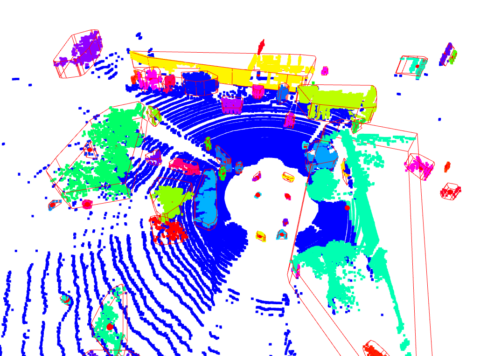
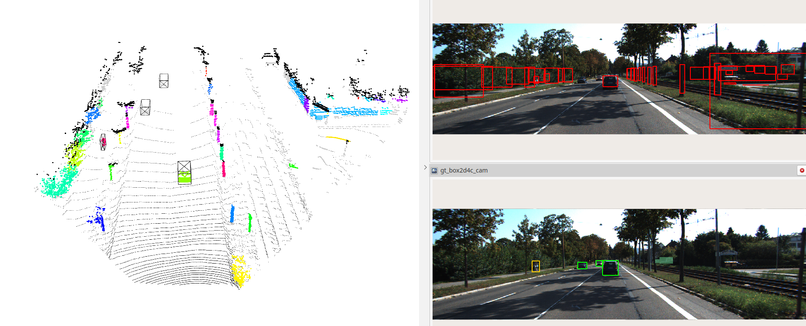

## README

含地面分割、聚类分割、形状拟合等算法的全家桶示例

### Non-ROS Version



```bash
$ python3 traditional_perception.py --pc_dir <点云文件夹>
```

### ROS Version

>**Note**
>
>暂时只支持KITTI数据集

- 步骤一：修改`config/kitti.yaml`中的相关参数，如数据集路径
- 步骤二：

```bash
$ python3 ros2_traditional_perception_kitti.py 
```

- 步骤三：启动可视化界面

```bash
$ rviz2 -d kitti_ros2.rviz 
```



## TODO

- [ ] 追加其他数据集的支持
- [ ] 追加对ROS1的支持